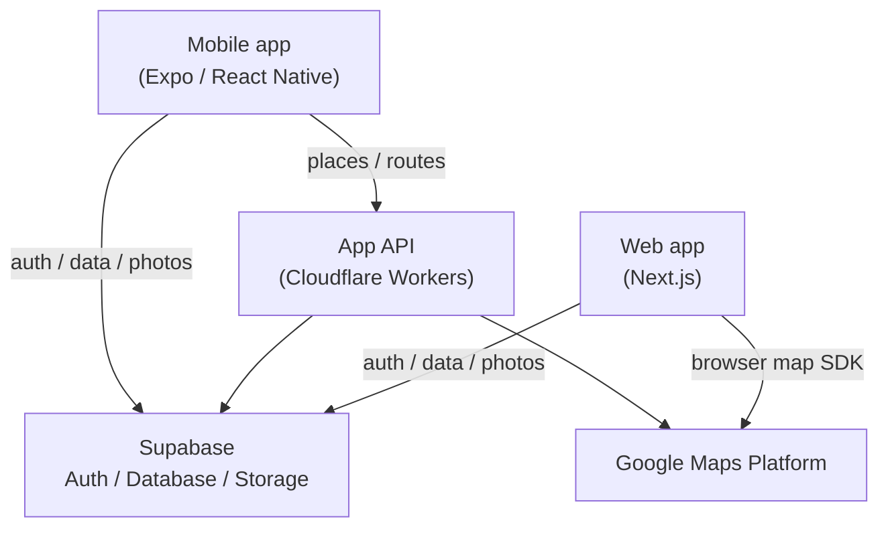

# Caplog

English | [日本語](README.md)

A mobile-first product for **finding places, turning them into outing plans, recording the experience, and reusing those records in the next plan**.

The current main client is the Expo / React Native mobile app.

- **Mobile:** Expo / React Native — actively developed and verified on a real Android device
- **Web:** https://caplog.jp — still in production

<p align="center">
  
  
  
  
</p>

<p align="center">
  Home / Create / Plan / Spot post
</p>

## Product concept

Caplog is not just a bookmark list for places you may want to visit.

The intended loop is:

1. **Discover** — find a place or outing idea
2. **Plan** — combine multiple spots into one route / outing plan
3. **Record** — keep photos and notes from the actual visit
4. **Reuse** — turn those records back into material for a future plan

The core idea is that an outing record should not be a dead end.
It should become input for what to do next.

## Technical highlights

### 🗺️ Interactive route map

The mobile plan map combines:

- numbered markers that preserve the actual plan order
- synchronized spot cards and map focus
- distance-aware zoom instead of one fixed zoom level
- locally decoded saved encoded polylines
- segment-level route rendering

If route data is missing, Caplog does **not** draw a fake straight line just to make the map look complete.

Unsupported travel modes such as train / bus remain line-less unless a real route is available.

Invalid decoded coordinates are rejected instead of being rendered.

Google-provided photos are handled together with attribution, and diagnostic logs avoid storing raw coordinates, Place IDs, or polyline bodies.

→ [Map system details](docs/map-system.md)

### 🔗 Public URL architecture

Internal database UUIDs are separate from public-facing IDs.

Public post URLs use:

```text
/posts/{prefecture}/{city}/{public_id}
```

The same URL rule is used across:

- Web navigation
- Mobile sharing
- post-create API responses
- canonical URLs
- Open Graph URLs
- sitemap generation

Legacy UUID URLs remain supported.

When a canonical public URL can be built, the old URL redirects with **308 Permanent Redirect**.
If required public fields are missing, Caplog falls back to the UUID route rather than turning migrated / incomplete data into a 404.

→ [Public URL design](docs/public-url-design.md)

### ☁️ Mobile App API boundary

The mobile app does not directly call server-oriented Google Places / Routes APIs with embedded credentials.

Instead:

```text
Mobile
  ↓ Supabase Bearer
App API (Cloudflare Workers)
  ↓
Google Places / Routes
```

The App API handles:

- Supabase user verification
- user-level rate limits
- fail-closed behavior for paid endpoints
- Field Masks
- sanitized upstream errors
- reduced mobile response shapes
- counts / status-oriented logs

The mobile gateway is deployed separately from the Web app.

That keeps server-side credentials and billing controls away from the client and separates mobile API traffic from normal Web delivery.

→ [App API details](docs/app-api.md)

### 🔒 Privacy-aware photo flow

When Caplog builds plan candidates from photos, the goal is not to upload the original photo just to discover where / when it was taken.

The flow uses device-side photo metadata such as time and location where possible.

### 🔁 Shared data, separate clients

Mobile and Web share the same Supabase Auth / Database / Storage data.

There is not a separate "mobile copy" of plans, spots, and posts.

The clients are different, but the product data is shared.

### 📱 Real-device verification

The mobile app is developed with an Expo dev client and verified on a real Android device.

This matters for behavior that cannot be trusted from static mocks alone:

- maps
- location
- photo flows
- Android marker rendering
- device-specific UI behavior

## Architecture



The App API is a server-side boundary for mobile external-API calls.
Credentials that should not live in the mobile bundle stay behind that boundary.

## Map design choices

A few behaviors are intentionally conservative.

### No fake route geometry

If Caplog cannot verify the real route segment, it leaves the segment blank.

A visually complete map is less important than not showing a route that never existed.

### Segment-level partial success

A multi-spot route is split into adjacent segments.

If one segment fails:

- successful segments remain usable
- the failed segment is stored as unavailable
- the plan itself does not fail as a whole

### Distance-aware focus

Map focus is based on the distance from the selected spot to its nearest other spot and clamped within reasonable bounds.

This avoids:

- overlapping pins when places are close
- over-zooming when places are far apart

The focus center is also adjusted for the bottom card carousel.

## Public URL decisions

The public URL design deliberately separates:

- **internal identity** — UUID for relations / authorization
- **public identity** — short `public_id` for URLs

The public id is **not** an authorization boundary.

Private-data protection remains an authentication / ownership / database concern.

The URL migration also preserves older links rather than requiring all historical data to be perfectly migrated before the new structure can ship.

## App API decisions

### Fail-closed for paid provider calls

Places / Routes calls can create external cost.

If the rate-limit layer itself is unavailable, the API does not fail open and continue sending unlimited paid requests.

Paid endpoints stop.

Health / diagnostics without external billing can use a different failure policy.

### Do not proxy raw provider responses

Google responses are not forwarded directly to Mobile.

The Worker selects only required fields and returns a smaller app-specific shape.

This reduces:

- provider coupling
- accidental exposure of unused fields
- payload size
- unnecessary API / SKU cost

### Field Masks

The App API requests only the fields needed by the product.

For example:

- Place Details → fields used by the actual screen
- Routes → encoded polyline required for route rendering

### Counts-only / status-oriented logging

Diagnostic logging keeps useful operational information without turning logs into a location-history store.

Logs can keep things such as:

- request id
- status
- counts
- short error code

They intentionally avoid:

- Bearer tokens
- API credentials
- user ids
- search strings
- Place IDs
- coordinates
- encoded polyline bodies
- provider raw responses / errors

## Development approach

- Mobile-first development
- Web remains in production
- shared Supabase data model
- Expo dev client + Metro for fast real-device iteration
- real Android verification before treating device behavior as complete

The production source and internal development material are maintained privately.
This repository is a public engineering / product showcase.

## Mobile feature scope

Current implemented areas include:

### Discover

- highlighted / new / popular plans
- theme and search filters

### Create

- build a plan by ordering multiple spots
- create from photo metadata
- create from previously recorded outing spots

### Record

- spot posts with photos and notes
- multiple images per post

### Manage

- saved plans / spots
- own plans / own spots
- map display for plan / spot locations

## Tech stack

### Mobile

- Expo
- React Native
- TypeScript
- Supabase
- React Navigation
- react-native-maps

### Web

- Next.js
- React
- TypeScript
- Supabase
- Cloudflare Workers / OpenNext
- Google Maps

## Documentation

- [Architecture](docs/architecture.md)
- [Map system](docs/map-system.md)
- [Public URL design](docs/public-url-design.md)
- [App API](docs/app-api.md)

The deeper technical documents are currently written mainly in Japanese; the English README summarizes the key architecture and product boundaries.

## AI-assisted development

Generative AI is used as a development, research, and review partner.


---

> This repository is a public showcase of Caplog.  
> Production source code and internal development materials are maintained privately.
