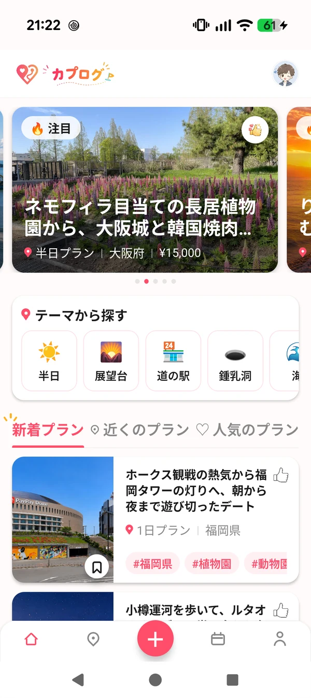
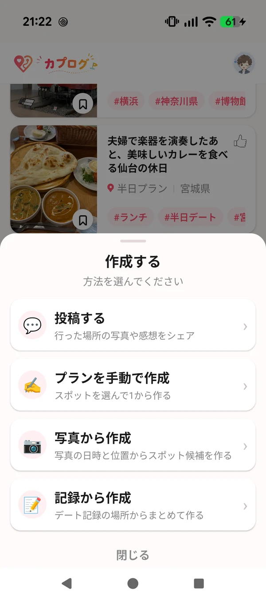
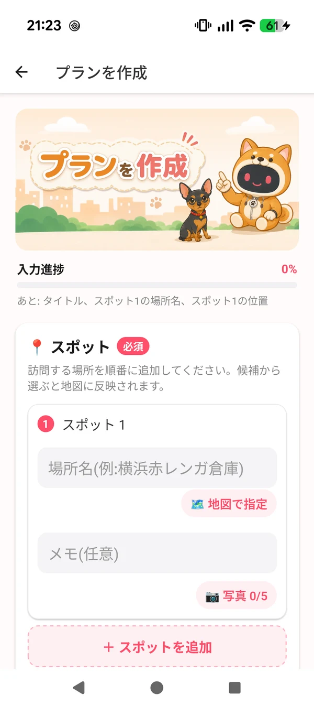
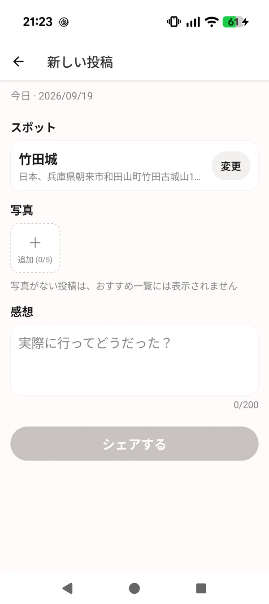
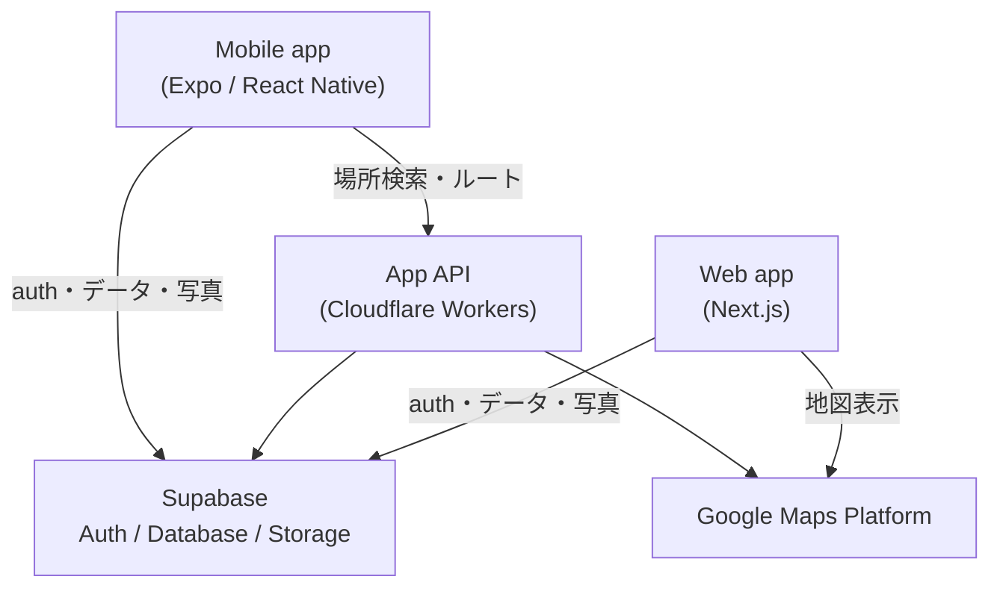

# カプログ / Caplog

デートやお出かけを「見つける・作る・記録する」ためのモバイル中心のプロダクト。

現在のメインクライアントは Expo / React Native で開発している Mobile アプリです。

- **Mobile:** Expo / React Native — Android 実機で開発・確認中
- **Web:** https://caplog.jp — 継続運用中

  
  
  
  

  Home　/　作成方法　/　プラン作成　/　スポット投稿

## Product concept

行きたい場所をブックマークしておくアプリではありません。
次の 4 つがひと続きの循環になることを目指しています。

1. **見つける** — 次のお出かけ候補を探す
2. **プランにする** — 複数のスポットを 1 本のプランとしてまとめる
3. **記録する** — 実際に行った体験を写真と感想で残す
4. **つなげる** — その記録を次のプランの素材にする

「行った」で終わらせず、記録がそのまま次の計画の入力になる点が中心にあります。

> **なぜこの設計にしたか:** [Owner Decision Log](docs/OWNER_DECISIONS.md)  
> Mobile-firstへ移した理由、URL移行、地図で嘘の直線を描かない判断、App API分離、fail-closed、privacy境界などをまとめています。

## Technical highlights

### 🗺️ Interactive route map

プラン順と一致する番号付きマーカー、スポットカルーセルと地図の同期、近接スポット間の距離から計算する動的ズーム、保存済み encoded polyline のローカル decode までを組み合わせています。

経路情報が無い区間を見た目だけの直線で補完せず、電車・バスなど未対応区間は線なしにする方針です。Google 写真は attribution とセットで扱い、座標や Place ID を診断ログへ残さない境界も設けています。

→ [Map system の詳細](docs/map-system.md)

### 🔗 Public URL architecture

DB 内部の UUID と公開用 `public_id` を分離し、公開 URL は `/posts/{prefecture}/{city}/{public_id}` に統一しています。

Web / Mobile の navigation、共有 URL、投稿作成 API、canonical、OGP、sitemap を同じ URL 生成ルールへ寄せ、旧 UUID URL は正規 URL へ 308 redirect。必要情報が欠けた場合は UUID URL へ fallback して壊れないようにしています。

→ [Public URL design の詳細](docs/public-url-design.md)

### ☁️ Mobile App API boundary

Mobile から Google Places / Routes を直接呼ばず、Cloudflare Workers の App API を境界にしています。

Supabase Bearer 認証、ユーザー単位 rate limit、課金 endpoint の fail-closed、Field Mask、sanitized error、counts-only logging を組み合わせ、Places / Routes の server-side credential や raw response を Mobile 側へ持ち込まない構成です。App API は Web 本体とは別 deployment に分けています。

→ [App API の詳細](docs/app-api.md)

### 🔒 Privacy-aware photo flow

写真からプラン候補を作るときは、候補生成のために写真本体をアップロードせず、端末内の日時・位置情報を使います。

### 🔁 Shared data, separate clients

Mobile / Web は Supabase Auth / Database / Storage を共通基盤として使い、別々のデータコピーを持ちません。クライアントは分けつつ、同じプラン・スポット・投稿を扱います。

### 📱 Real-device verification

Expo dev client と Android 実機（Pixel 9）を使い、地図・位置情報・写真など端末依存の挙動を実機で確認しながら開発しています。

## Mobile features

現在実装されている範囲です。

**探す**

- 注目 / 新着 / 人気のプラン
- テーマ（半日・展望台・道の駅 など）や検索からの絞り込み

**作る**

- 複数スポットを順番に並べてプランを作成
- 写真から作成（写真の日時と位置からスポット候補を起こす）
- 記録から作成（デート記録のスポットをまとめてプラン化）

**記録する**

- スポット投稿（訪問したスポットを写真・感想付きで投稿）
- 写真は 1 投稿あたり複数枚まで添付可能

**管理する**

- プラン / スポットの保存
- 自分のプラン・自分のスポット・保存したプラン / スポットの一覧
- プランやスポットの位置の地図表示

## Tech stack

**Mobile**

- Expo
- React Native
- TypeScript
- Supabase
- React Navigation
- react-native-maps

**Web**

- Next.js
- React
- TypeScript
- Supabase
- Cloudflare Workers / OpenNext
- Google Maps

## Architecture

Mobile と Web は同じ Supabase のデータを参照します。

App API は Mobile 向けのゲートウェイで、外部 API の呼び出しをサーバー側にまとめ、
結果をキャッシュする役割を持ちます。クライアントに置けない資格情報はこの層より内側にとどまります。

詳細は [docs/architecture.md](docs/architecture.md) を参照してください。

## Development

- Mobile-first で開発しています
- Android 実機（Pixel 9）で動作確認しています
- Expo dev client + Metro で、UI / JS の変更を実機へ即時反映しながら進めています
- Web / Mobile / 調査資産は 1 つの private monorepo で管理しています
- Web 版も継続して運用中です

## AI について

開発・調査には生成 AI を補助的に利用しています。
仕様・UX・実機確認・最終判断は人間が行っています。

---

> This repository is a public showcase of Caplog.
> Production source code and internal development materials are maintained privately.
