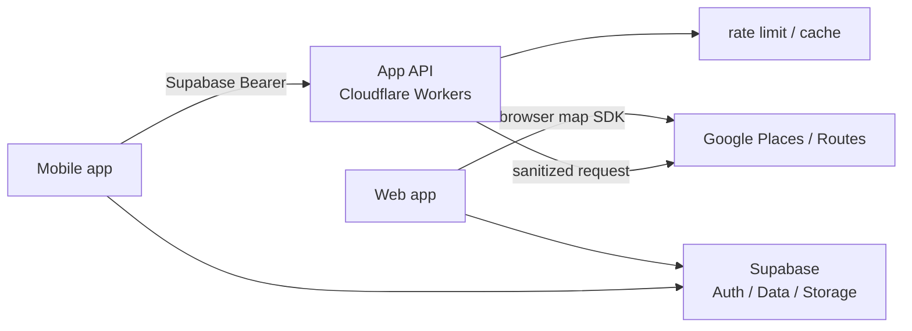

# App API

Mobile から Google Places / Routes などの外部 API を直接呼ばず、Cloudflare Workers 上の App API を境界として置いています。

## 全体像



Web と Mobile は同じデータ基盤を使いますが、Mobile の外部 API トラフィックは Web 本体とは別の Worker に分離しています。

## 1. API key を Mobile bundle に置かない

Places / Routes のサーバー向け API を Mobile から直接呼ぶと、credential をクライアントへ持たせる必要があります。

そのため Mobile は App API を呼び、外部 API の credential は Worker 側だけで扱います。

Web の地図描画はブラウザ向け SDK を使うため、Mobile の gateway とは責務を分けています。

## 2. Supabase Bearer でユーザーを確認する

保護された endpoint は、Mobile の Supabase session から渡された Bearer token を Worker で検証します。

token の有無だけで信用せず、Supabase Auth で実ユーザーを解決してから後続処理へ進みます。

認証失敗時に provider の raw error や token 内容を response / log に含めません。

## 3. 課金対象 endpoint は fail-closed の rate limit

Places / Routes のような外部課金が発生する endpoint は、ユーザー単位で rate limit をかけています。

rate-limit 基盤そのものが利用できない場合に外部 API へ無制限に流すのではなく、**fail-closed** で止める設計です。

一方、外部課金を伴わない health / auth diagnostics とは failure policy を分けています。

## 4. Google raw response をそのまま Mobile へ返さない

App API は外部 API の response をそのまま proxy しません。

必要な field だけを Worker 側で読み取り、Mobile 用の小さい response shape に整形します。

同様に、upstream error も raw body を返さず、UI が扱える短い error code と generic message に変換します。

## 5. Field Mask で取得範囲を絞る

Google API へ要求する field も必要最小限にします。

例:

- Place Details では画面に必要な住所・位置・typeなどへ限定
- Routes では経路線に必要な **encoded polyline だけ**を要求

payload を小さくするだけでなく、Places の SKU / API コストを不必要に上げないことも設計条件に含めています。

## 6. Routes は区間ごとの部分成功

複数スポットの経路は、隣り合うスポットごとの区間として処理します。

徒歩・車・自転車は対応する区間を並列で取得し、1区間だけ upstream が失敗しても他の区間は利用できます。

```text
spot 1 ── segment 1 ── spot 2 ── segment 2 ── spot 3
             OK                     failed
             │                        │
             └─ save polyline         └─ null / lineなし
```

電車・その他の未対応 mode は外部 API を無理に呼ばず skip します。

## 7. counts-only の診断ログ

外部 API の問題を調べられるように request id、status、件数、短い error code などは残しますが、次の値はログへ出さない方針です。

- Bearer token
- API credential
- ユーザー ID
- 検索文字列
- Place ID
- 緯度・経度
- encoded polyline
- Google の raw response / raw error

「診断できること」と「ユーザーデータを残しすぎないこと」を両立させるため、ログの shape 自体を制限しています。

## 8. Web 本体と障害境界を分ける

App API は Web 本体とは別 deployment です。

Mobile の Autocomplete や Routes 呼び出しが増えても、Web の通常閲覧と同じ Worker の CPU / request budget を直接奪わない構成にしています。

Google / Supabase など共通の外部依存は残りますが、アプリ専用トラフィックと Web 配信の責務・deploy・障害範囲を分離しています。
