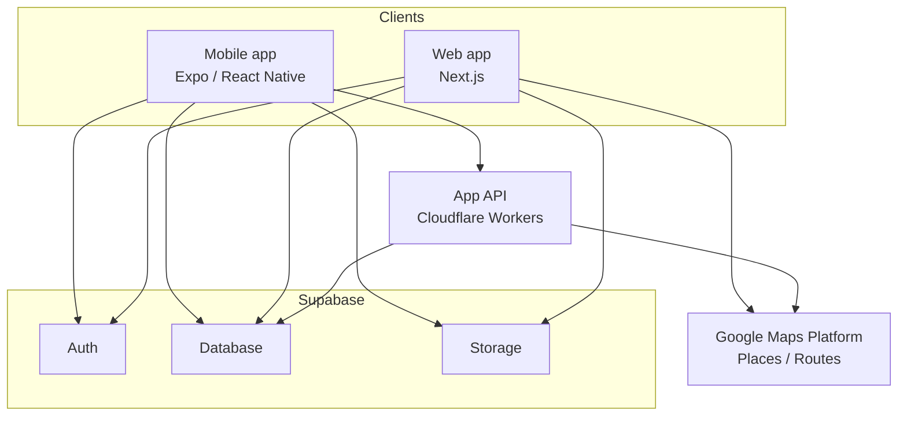

# Architecture

Caplog の構成を、公開できる抽象度でまとめたものです。
実装の詳細・運用手順・資格情報の扱いは含みません。

## 全体像

## クライアント

### Mobile（主クライアント）

Expo / React Native。プランとスポットの閲覧・作成・記録を行います。
Supabase へは認証済みクライアントとして直接アクセスし、
外部の場所情報が必要な操作は App API を経由します。

### Web

Next.js。同じデータをブラウザから利用する現行クライアントです。
地図は JavaScript の地図 API をブラウザ側で利用します。

## App API

Cloudflare Workers 上で動くゲートウェイで、Mobile 向けに提供しています。

担当する範囲:

- 場所の検索・詳細・周辺検索・写真取得
- ルート区間の取得
- 取得結果のキャッシュ
- レート制限
- リクエスト単位の認証チェック
- アカウント削除の受け口

この層を挟む理由は 2 つあります。

1. **資格情報をクライアントに置かない** — 外部 API を呼ぶための資格情報はサーバー側にとどめ、アプリのバンドルには含めません
2. **外部 API の呼び出し回数を抑える** — 同じ場所への問い合わせをキャッシュし、クライアントから直接叩かせない

## Supabase

- **Auth** — OAuth（Google / LINE）とメールによるサインイン
- **Database** — プラン、スポット、投稿、コメント、保存などの永続化。行レベルのアクセス制御で、閲覧可能な範囲をデータベース側で決めます
- **Storage** — 投稿写真の保存

Mobile / Web は同じデータを共有します。

## 外部サービス

### 地図・場所情報

Google Maps Platform を利用します。

- Mobile: 地図描画はネイティブの地図コンポーネント、場所情報の取得は App API 経由
- Web: 地図描画はブラウザ側の地図 API

場所情報の取得をサーバー側に寄せているのは、資格情報の保護と呼び出し回数の抑制のためです。

### 写真

投稿写真は Supabase Storage に保存します。
端末で撮影した写真からスポット候補を起こす機能では、写真そのものをアップロードせず、
日時と位置の情報だけを候補生成に使います。

## 認証

サインインは Supabase Auth が扱います。
セッションは端末のローカルストレージに保持し、Supabase / App API への
リクエストはいずれも認証済みの状態で行われます。

## 設計上の方針

- **クライアントに秘密を置かない** — 外部サービスの資格情報はサーバー側に閉じ込める
- **データベース側でアクセス制御する** — クライアントの実装ではなく、行レベルのポリシーで可視範囲を決める
- **外部 API のコストを抑える** — キャッシュとレート制限を挟み、呼び出し回数を管理する
- **Mobile と Web で同じデータを見る** — クライアントごとにデータを分けない

## Technical deep dives

- [Map system](map-system.md) — 番号付きマーカー、カルーセル同期、動的ズーム、route polyline
- [Public URL design](public-url-design.md) — internal UUID / public ID 分離、canonical、308 redirect
- [App API](app-api.md) — Mobile API gateway、Bearer auth、rate limit、Field Mask、sanitized logging
