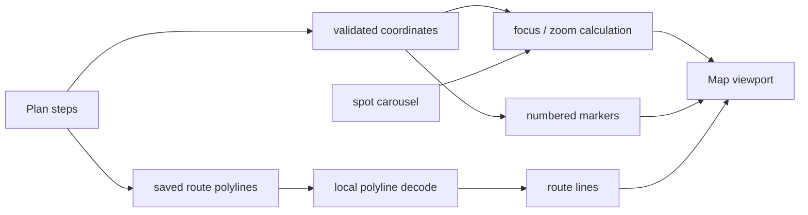

# Map system

Caplog の Mobile 地図は、単にスポットへピンを置くだけではなく、**プランの順序・経路・カード操作を同じ状態として扱う**ようにしています。

## 全体像



## 1. プラン順と一致するマーカー

各スポットにはプラン上の順番を保持し、その番号を地図上のマーカーにも表示します。

座標を持たないスポットが途中にあって地図から除外されても、番号を振り直しません。
そのため、タイムラインの「3番目」と地図の「3番ピン」がずれないようにしています。

マーカーは画像ではなく React Native の View / Text で構成し、Android では初回描画後に静的化して不要な再描画を抑えます。

## 2. カルーセルと地図を同期する

地図下のスポットカードを横にスワイプすると、settle したカードを基準に該当スポットへ地図を移動します。

同じスポットへの重複した自動フォーカスは抑制しつつ、ユーザーがカードを明示的に押した場合は再フォーカスできるように分けています。

## 3. 近接スポットではズーム量を動的に決める

固定 zoom では、近いスポット同士のピンが重なりやすく、逆に離れたスポットでは寄りすぎる問題がありました。

そこでフォーカス時は、対象スポットから**最も近い別スポットまでの距離**を使って表示範囲を計算し、最小・最大値の間に収めています。

```text
focused spot
    │
    ├─ nearest other spot
    │        │
    │        └─ approximate distance
    │
    └─ distance × separation factor
             │
             └─ clamp(min, max)
                      │
                      └─ viewport delta
```

カードが地図下部へ重なるため、フォーカス中心もわずかに補正し、選択中のピンが見やすい位置へ移動させます。

## 4. 経路線は「保存 → decode → 描画」

プラン作成時、徒歩・車・自転車の隣接スポット間について App API が Routes API から encoded polyline を取得し、投稿データに保存します。

表示時に Mobile 側で encoded polyline を純 TypeScript で decode し、`react-native-maps` の `Polyline` に渡します。

- decode 結果が不正
- 座標が範囲外
- 点が 2 点未満

の場合は線を描かず、安全側へ倒します。

### 嘘の直線を描かない

経路情報が無い区間を、見た目だけの直線で補完することはしません。

特に電車・バスなど、道路上の直線では実際の移動を表せない区間は、対応する経路が無ければ**線なし**にします。

App API 側でも経路取得は区間単位で扱い、1 区間の失敗でプラン全体を失敗させません。取得できた区間だけ保存し、失敗区間は線なしのまま利用できます。

## 5. 座標は段階的に fallback する

既存投稿が持つ座標を優先し、それが無い場合だけ Google Place 由来の表示用座標を fallback として使います。

どちらの経路でも緯度・経度の finite / range check を行い、不正な値はマーカーへ渡しません。

表示用の fallback 座標は、既存の保存座標そのものを書き換える用途には使いません。

## 6. Google 写真は attribution とセットで扱う

Google 由来の写真を地図カードへ補完する場合、写真だけを表示せず attribution も同じ表示フローで扱います。

- structured attribution だけを使用
- 提供者名を重複排除
- 外部リンクは HTTPS のみ許可
- 生 HTML は扱わない

## 7. ログへ位置情報を出さない

地図や経路の処理では、診断のために必要な件数や状態は記録しても、以下の実値をログへ出さない方針です。

- 緯度・経度
- Place ID
- encoded polyline 本文
- 外部 API の raw response

地図を便利にする処理と、位置情報を不用意に残さない境界を分けています。
