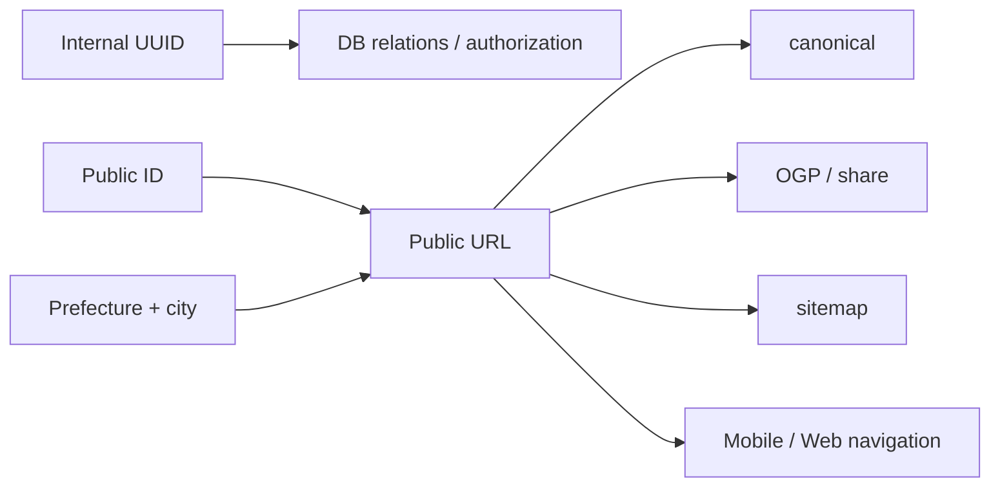

# Public URL design

Caplog では、データベース内部の識別子と、ユーザーが見る公開 URL の識別子を分けています。

## 2つの identity



### Internal UUID

内部 UUID は、DB の relation や更新対象の特定など、アプリ内部の identity として使います。

### Public ID

公開 URL では、内部 UUID とは別の短い `public_id` を使います。

- 6文字
- 英小文字 + 数字
- `0/o/1/l/i` など、見間違えやすい文字を除外
- Web Crypto の乱数源から生成

`public_id` は公開用の識別子であり、認可の仕組みではありません。
非公開データの保護は認証・所有者判定・データベース側のアクセス制御で行います。

## 公開 URL

基本形は次の階層です。

```text
/posts/{prefecture}/{city}/{public_id}
```

地域を URL に含めることで、ユーザーが見たときの意味を持たせつつ、投稿そのものは短い `public_id` で識別します。

## URL生成を1つのルールへ寄せる

URL を画面ごとに手書きすると、Web と Mobile、OGP、sitemap、共有リンクで少しずつ違う URL が生成されるリスクがあります。

そこで `buildPostUrl` という同じ仕様を Web / Mobile に持ち、次の用途を同じルールへ寄せています。

- Web 内部リンク
- Mobile からの共有 URL
- 投稿作成 API の成功 response
- canonical URL
- Open Graph URL
- sitemap
- 編集画面への遷移

Mobile では同じ path を `https://caplog.jp` と組み合わせ、公開用の絶対 URL として扱います。

## 旧 UUID URL を壊さない

過去の URL や外部リンクを突然 404 にしないため、旧形式の UUID URL も受け付けます。

投稿を解決でき、新しい公開 URL を構築できる場合は、旧 URL から正規 URL へ **308 Permanent Redirect** します。

```text
/posts/{uuid}
     │
     ├─ post not found / unauthorized → 404
     │
     └─ post resolved
           │
           ├─ public URL available → 308 redirect
           │
           └─ public URL unavailable → UUID URLで表示
```

redirect loop を避けるため、URL生成が fallback の UUID URL を返した場合は自分自身へ redirect しません。

## 不完全データでも壊れない fallback

`prefecture` / `city` / `public_id` のいずれかが欠けている場合、URL builder は内部 UUID を使う旧形式へ fallback します。

通常運用では公開 URL の必要情報が揃う前提ですが、移行データや予期しない欠損でアプリ全体が壊れないための安全網として残しています。

## URLとSEOを同じ正本から作る

公開 URL は navigation だけでなく、canonical・OGP・sitemap にも使います。

そのため、検索エンジンへ示す URL と、ユーザーが共有する URL と、アプリが遷移する URL が別々の規則にならないようにしています。
